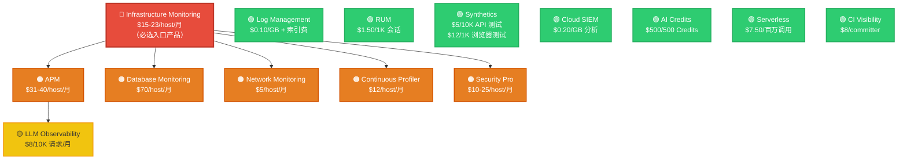
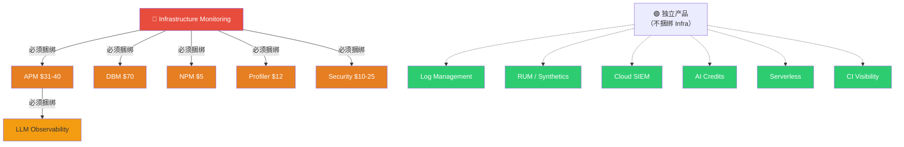
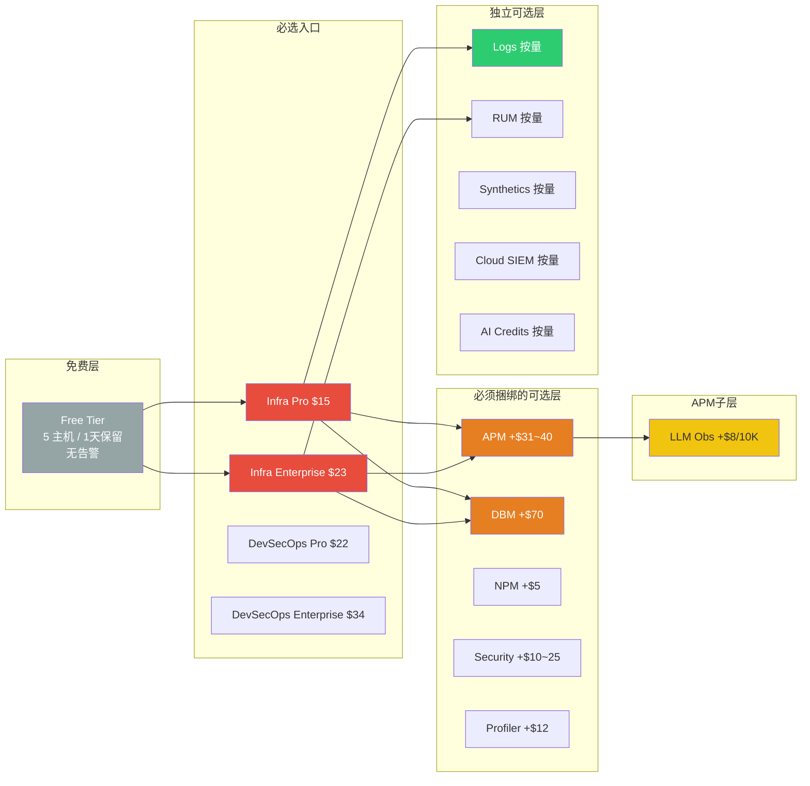

# Datadog 产品依赖关系图

## 版本一：完整依赖树（适合详细分析）



---

## 版本二：简化版（适合 PPT 展示）



---

## 版本三：计费叠加视图（适合成本分析）



---

## 版本四：文字版 ASCII（适合纯文本环境）

```
┌─────────────────────────────────────────────────────────────┐
│                  🔴 Infrastructure Monitoring                │
│                    $15-23/host/月 (必选)                      │
└──────────────────────────┬──────────────────────────────────┘
                           │
        ┌──────────────────┼──────────────────┐
        │                  │                  │
        ▼                  ▼                  ▼
┌───────────────┐  ┌───────────────┐  ┌───────────────┐
│  🟠 APM       │  │  🟠 DBM       │  │  🟠 NPM       │
│  $31-40/host  │  │  $70/host     │  │  $5/host      │
└───────┬───────┘  └───────────────┘  └───────────────┘
        │
        ▼
┌───────────────┐  ┌───────────────┐  ┌───────────────┐
│  🟡 LLM Obs   │  │  🟠 Profiler  │  │  🟠 Security   │
│  $8/10K req   │  │  $12/host     │  │  $10-25/host  │
└───────────────┘  └───────────────┘  └───────────────┘


    🟢 独立产品 (不依赖 Infra，可直接购买)

┌───────────┐ ┌───────────┐ ┌───────────┐ ┌───────────┐
│ Log Mgmt  │ │   RUM     │ │Synthetics │ │Cloud SIEM │
│ 按量计费  │ │ 按量计费  │ │ 按量计费  │ │ 按量计费  │
└───────────┘ └───────────┘ └───────────┘ └───────────┘
┌───────────┐ ┌───────────┐ ┌───────────┐
│AI Credits │ │Serverless │ │CI Visibl. │
│ 按量计费  │ │ 按量计费  │ │ 按量计费  │
└───────────┘ └───────────┘ └───────────┘
```

---

## 图例

| 颜色 | 含义 |
|------|------|
| 🔴 红色 | 必选入口产品 |
| 🟠 橙色 | 必须捆绑 Infra 的产品 |
| 🟡 黄色 | 二级依赖（捆绑 APM） |
| 🟢 绿色 | 独立产品，可直接购买 |

---

> 提示：Mermaid 流程图可在 VS Code（安装 Mermaid 插件）、GitHub Markdown、Typora、Notion 等工具中直接渲染。复制对应代码块即可使用。
